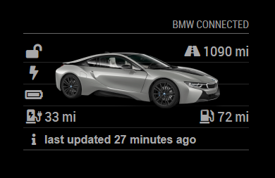

# MMM-BMWConnected
Magic Mirror Module to display data from BMW Connected drive for your car(s).

**The module has been deprecated due to changes in BMW back-end. Please use [this module](https://github.com/Jargendas/MMM-MyBMW) instead**

The module displays icons to show lock, charging and battery status, electric and combined range, and total kilometers driven. It also shows the time the Connected Drive API last received data from the car.

If you own several BMW cars, you can configure a module for each of them. The module configuration requires the vin number of the car to separate multiple module instances.

## Installation

Clone this repository in your modules folder, and install dependencies:

    cd ~/MagicMirror/modules 
    git clone https://github.com/jannekalliola/MMM-BMWConnected.git
    cd MMM-BMWConnected
    npm install 

## Configuration

Go to the MagicMirror/config directory and edit the config.js file. Add the module to your modules array in your config.js.

You'll need your BMW Connected Drive email and password, and your car's vin number.

Enter these details in the config.js for your MagicMirror installation:

        {
            module: "MMM-BMWConnected",
            header: 'BMW Connected',
            position: "top_right",
            config: {
                email: "email@example.com",
                password: "myComplexPassword",
                vin: "XXXXXXXXXXXXXXXXX"
            }
        },

## Module configuration
The module has a few configuration options:

<table>
  <thead>
    <tr>
      <th>Option</th>
      <th>Description</th>
    </tr>
  </thead>
  <tbody>
    <tr>
      <td><code>email</code></td>
      <td>Your username or email for the BMW Connected Drive platform, required.  <strong>Default: </strong><code>undefined</code></td>
    </tr>
    <tr>
      <td><code>password</code></td>
      <td>Your password for the BMW Connected Drive platform, required.  <strong>Default: </strong><code>undefined</code></td>
    </tr>
    <tr>
      <td><code>vin</code></td>
      <td>Your car's vin code, required.  <strong>Default: </strong><code>undefined</code></td>
    </tr>
    <tr>
      <td><code>apiBase</code></td>
      <td>The location of the base API URL for your region.  <strong>Default: </strong><code>cocoapi.bmwgroup.com</code></td>
    </tr>
    <tr>
      <td><code>refresh</code></td>
      <td>How often to refresh the data in minutes.   <strong>Default: </strong><code>15</code> </td>
    </tr>
    <tr>
      <td><code>vehicleOpacity</code></td>
      <td>The opacity of the car image.   <strong>Default: </strong><code>0.75</code> Between 0 and 1.</td>
    </tr>
    <tr>
      <td><code>distance</code></td>
      <td>The unit of distance used for mileage and range.   <strong>Default: </strong><code>miles</code> Can be: miles or km.</td>
    </tr>
    <tr>
      <td><code>showMileage</code></td>
      <td>Whether to show the mileage.   <strong>Default: </strong><code>true</code>
    </tr>
    <tr>
      <td><code>showElectricRange</code></td>
      <td>Whether to show the electric range.   <strong>Default: </strong><code>true</code>
    </tr>
    <tr>
      <td><code>showElectricPercentage</code></td>
      <td>Whether to show the battery charging also in percentages.   <strong>Default: </strong><code>false</code>
    </tr>
    <tr>
      <td><code>showFuelRange</code></td>
      <td>Whether to show the fuel range. Note that BMW API returns the electric range as fuel range for fully electric cars.  <strong>Default: </strong><code>true</code>
    </tr>
    <tr>
      <td><code>lastUpdatedText</code></td>
      <td>The text to be shown before last updated timestamp.   <strong>Default: </strong><code>last updated</code>
    </tr>
  </tbody>
</table>

## Thanks

Biggest thanks to [Howard Durdle](https://github.com/hdurdle) for writing the initial version and maintaining the module for several years.

Hat tip to [Nils Schneider](https://github.com/Lyve1981/BMW-ConnectedDrive-JSON-Wrapper) for the library code for performing the BMW authentication dance.

Thanks to [Eugen](https://github.com/yfre/MMM-BMWConnected) for fixing the connectivity issues.

## Changelog

**2022-12-13** Fixed BMW connectivity and added support for several module instances, separated by vin codes. Currently tested only with European region. The car image is downloaded from the API and stored into a local file. The angle of the car cannot be selected anymore due to BMW API changes.

**2022-06-13** Fixed mileage into kilometers, moved the car image to background, and added information about `vehicleOpacity` config option. Changed the example image.

**2022-05-30** Detached from previous versions.
